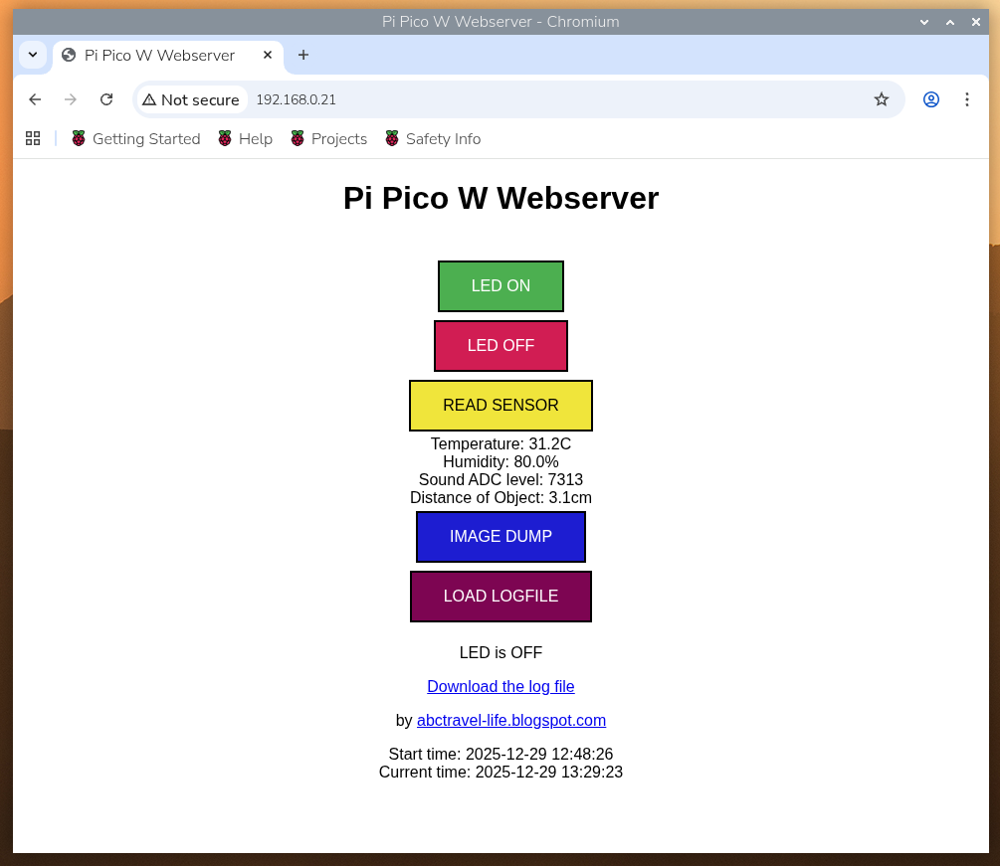

# :mouse: Welcome to Raspberry Pi Pico W MicroPython WebServer

<p float="left">
 
</p>

## Table of Contents
- [Description](#scroll-description)
- [Development Platform](#computer-development-platform)
- [Software Development](#floppy_disk-software-development)
- [Platform Tested](#iphone-platform-tested)
- [Buy Me a Coffee](#coffee-buy-me-a-coffee)
- [License](#page_with_curl-license)
- [Feedback and Suggestions](#speech_balloon-feedback-and-suggestions)

## :scroll: Description
Simple Raspberry Pi Poco W web server using MicroPython on Thonny

<p float="left">
 
</p>

## :computer: Development Platform
Program is coded on Thonny using MicroPython. I have tested on both MacBook Air and Raspberry Pi 5 running Thonny.

1. Open Thonny and upload all the files in the repository onto Raspberry Pi Pico W. Program is using MicroPython.
2. Open the file main.py
3. Modify the line in main.py with your own WiFi SSID and password. 
~~~~
   # Set up connection to WiFi
   ssid = 'your own wifi ssid'
   password = 'your own wifi password'
~~~~
5. Run main.py
6. Example:
~~~~
       MPY: soft reboot
       Connected
       ip = 192.168.0.21
       listening on ('0.0.0.0', 80)
       [2025, 12, 29, 0, 4, 48, 26, 0]
       (2025, 12, 29, 0, 12, 48, 26, 0)
       (2025, 12, 29, 0, 12, 48, 26, 0)
       Start time 2025-12-29 12:48:26
~~~~
8. Open web browser and type in the following:
       http://192.168.0.21 (make sure it is not https)
10. The following screen will be shown on the web browser:
<p float="left">
 
</p>
11. Functions & Features are:

~~~~
LED ON - Turn Pico W board LED ON
LED OFF - Turn Pico W board LED OFF
READ SENSOR - Acquire reading from Temperature, Humidity, Microphone and Proximity sensors
IMAGE DUMP - Still under development
~~~~
12. More to come

## :floppy_disk: Software Development:
This program is written in MicroPython:
- Following are the GPIO connection for various sensors:
~~~~
# Board Pin assignment for this program
# P28 - DHT temperature and humidity sensor
# P27 - sound sensor module (ADC)
# P16 - servo motor control (PWM)
# P22 - buzzer (PWM)
# P20 & P21 - oled display (I2C0)
# P03 & P02 - ultrasonic distance sensor (P03 - Trigger, P02 - Echo)
~~~~
- 
    
## :iphone: Platform tested:
I have tested my code on:
- Raspberry Pi Pico W and a web browser (Chrome, Firefox,Safari)

## :coffee: Buy Me a Coffee
If you appreciate my work, do support me by...<br>
<a href="https://www.buymeacoffee.com/chanlhock" target="_blank"></a>

## :page_with_curl: License
```
This program is licensed under the GNU General Public License v3.0 
Permissions of this strong copyleft license are conditioned on making  
available complete source code of licensed works and modifications,  
which include larger works using a licensed work, under the same  
license. Copyright and license notices must be preserved. Contributors  
provide an express grant of patent rights.
```
See the [GNU General Public License](LICENSE.txt) for more details.

## :speech_balloon: Feedback and Suggestions
For any feedback or suggestions, feel free to contact me via email:\
:email: chanlhock@gmail.com :mouse:
